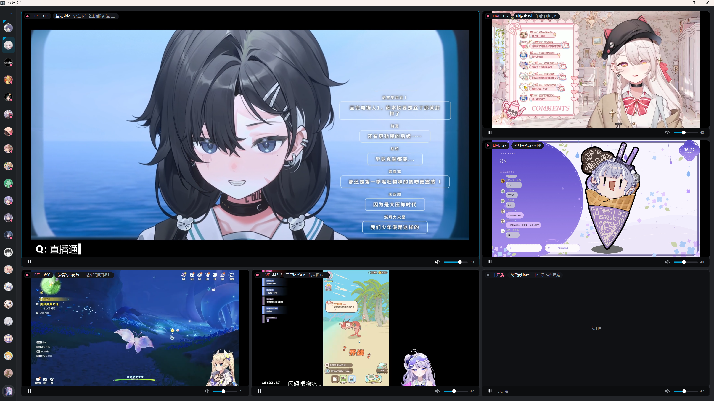
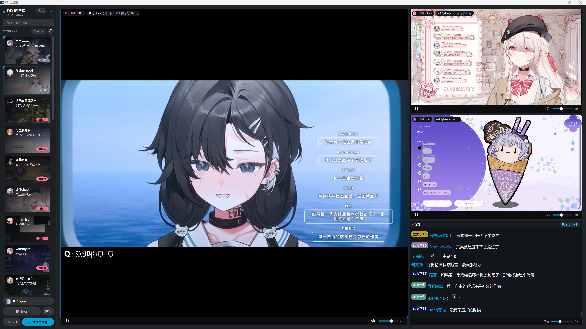

<div align="center">

# DD 监控室 CE

专为 B 站直播设计的多窗口监控与观看工具

[](#运行环境)
[](https://www.python.org/)
[](LICENSE)
[](https://github.com/Lanpropro/DD_Monitor_CE/commits/main)
[](https://github.com/Lanpropro/DD_Monitor_CE/stargazers)

[功能特性](#功能特性) · [快速开始](#快速开始) · [布局系统](#布局系统) · [开发指南](#开发指南) · [许可与来源](#许可与来源)

</div>

---

## 项目简介

DD 监控室 CE 是一款基于 Python、PySide6 和 VLC 的 B 站多窗口直播监控工具。

它可以将多个直播间集中显示在同一个画面墙中，并提供直播状态监控、关注导入、弹幕显示、自动布局和单路播放控制等功能。

本项目是 [DD监控室](https://gitee.com/zhimingshenjun/DD_Monitor_latest) 的二次开发版本，原作者：[执明神君](https://space.bilibili.com/637783)。在保留原项目取流与播放能力的基础上，尝试重构了界面及部分交互功能。


## 项目展示





## 功能特性

- 📺 最多同时管理 16 路直播画面
- 🧩 提供普通布局与弹幕布局
- 🔄 自动刷新主播开播、下播及直播间状态
- 🔔 支持开播提醒
- 👀 支持关注列表悬停预览
- 📌 支持主播置顶及拖动排序
- 🔐 支持 B 站扫码登录
- 📥 支持从 B 站账号导入关注列表
- 🎚️ 每个播放格可以独立设置音量、静音和画质
- 🛠️ 支持断流重连和画面卡死检测
- 💾 自动保存布局、音量、画质和界面状态

## 运行环境

目前仅支持 Windows。

| 组件 | 要求 |
| --- | --- |
| 操作系统 | Windows 10/11 |
| Python | 3.10 或更高版本 |
| VLC | VLC 3.x |
| 图形界面 | PySide6 |
| 播放组件 | python-vlc / libVLC |

## 快速开始

### 1. 获取项目

```powershell
git clone https://github.com/Lanpropro/DD_Monitor_CE.git
cd DD_Monitor_CE
```

### 2. 创建虚拟环境

```powershell
python -m venv .venv
```

### 3. 安装依赖

```powershell
.\.venv\Scripts\python.exe -m pip install -r requirements.txt
```

### 4. 准备 VLC 运行库

播放功能依赖以下文件：

```text
libvlc.dll
libvlccore.dll
plugins\
```

可以从 DD监控室原项目复制到本项目根目录，或安装 VLC 3.x 后从 VLC 安装目录复制。

### 5. 启动程序

- 双击 `run.cmd`：普通启动，不显示控制台。
- 双击 `run-console.cmd`：显示取流、重连及弹幕日志。
- 命令行运行：

```powershell
.\.venv\Scripts\python.exe main.py
```

## 基本使用

第一次启动时，关注列表和画面墙均为空。

1. 点击左下角「+ 添加直播间」。
2. 输入直播间号、直播间链接或短链接。
3. 将主播从关注列表拖入画面墙。
4. 点击「布局预设」选择画面布局。

登录 B 站账号后，还可以使用「导入关注」批量导入关注的主播。

> 登录凭证会保存在本地 `utils/config.json` 中。该文件已加入 `.gitignore`，请勿手动上传或分享。

## 布局系统

### 普通布局

- 自动布局
- 单画面、上下两分、左右两分
- 四分、六分、九分
- 主画面 + 2/3/4/6 个小画面
- 上 1 大 + 下 2、左 2 小 + 右 1 大
- 一大 + 一圈小、两大 + 侧 4 小

### 弹幕布局

- 主画面 + 弹幕
- 上 1 大 + 小画面 + 弹幕
- 主画面 + 1/2/3 小 + 弹幕
- 弹幕在左 + 主画面 + 2 小

弹幕格会自动跟随当前主画面的直播间。如果直播间数量超过当前布局的预设格子数，额外画面会继续向下排列。

## 关注列表

| 排序方式 | 说明 |
| --- | --- |
| 自定义顺序 | 通过拖动调整顺序，并自动保存 |
| 开播优先 | 正在直播的主播自动排在前面 |
| 导入顺序 | 按主播加入关注列表的先后排列 |

置顶的直播间始终位于列表顶部。手动拖动列表后，程序会自动切换回自定义排序。

## 弹幕功能

弹幕面板目前支持：

- 粉丝牌和 B 站表情显示
- 字体与字号调整
- 屏蔽词过滤

未登录时，部分弹幕用户名可能会被 B 站隐藏，建议登录后使用。

## 快捷键

| 默认按键 | 功能 |
| --- | --- |
| `F` | 将鼠标所在的直播画面设为主画面 |
| `Esc` | 恢复上一个布局 |
| `M` | 只保留鼠标所在画面的声音 |

快捷键可以在程序设置中修改。

## 配置、日志与缓存

| 内容 | 路径 |
| --- | --- |
| 用户配置 | `utils/config.json` |
| 配置备份 | `utils/config.json.bak` |
| 运行日志 | `logs/ddm-YYYY-MM-DD.log` |
| 主播头像 | `cache/avatars/` |
| 直播封面 | `cache/covers/` |
| 弹幕表情 | `cache/emoticons/` |

## 开发指南

安装依赖后，可以运行全部离线自检：

```powershell
dev\run-checks.cmd
```

主要开发文件：

- `ddm/theme.py`：颜色、字号和圆角等设计令牌。
- `ddm/widgets.py`：主要界面控件。
- `ddm/app.py`：应用状态及业务流程。
- `ddm/layouts.py`：画面布局。
- `ddm/player.py`：播放器控制。

## 已知限制

- 目前仅在 Windows 上使用和测试。
- 依赖 B 站非公开接口，接口调整可能导致部分功能失效。
- VLC 运行库需要用户自行准备。
- 原项目的热榜和悬浮窗功能尚未迁移。
- 录制、发送弹幕、接别的直播平台都不放在本体里，走插件接口。

## 插件

不想塞进本体的功能可以做成插件。插件放 `plugins_user/<插件名>/plugin.py`，
接口说明见 [`docs/plugins.md`](docs/plugins.md)。

- 可直接用的例子：`plugins_user/danmaku_log/`（弹幕落盘 + 发弹幕）
- 接别的平台的骨架：`plugins_user/_template_platform/plugin.py`

插件是受信任代码，和本体同进程运行 —— 只装自己看过源码的插件。
还没做、打算怎么做的，记在 [`idea.txt`](idea.txt)。

## 贡献

欢迎提交 Issue 或 Pull Request。提交问题时，建议附上 Windows、Python 和 VLC 版本、问题复现步骤、对应日志及必要的界面截图。
你也可以尝试直接私信[b站账号](https://space.bilibili.com/193559518)
请在分享日志前检查并移除账号凭证等敏感信息。

## 致谢

- [DD监控室](https://gitee.com/zhimingshenjun/DD_Monitor_latest)：原始项目及主要播放、取流实现参考。
- [blivedm](https://github.com/xfgryujk/blivedm)：B 站直播弹幕协议实现。
- [BewlyCat](https://github.com/keleus/BewlyCat)：界面配色和部分视觉设计参考。

详细来源说明请参阅 [`NOTICE.md`](NOTICE.md)。

## 许可与来源

本项目基于 **GNU Lesser General Public License v2.1** 发布。

使用、修改或分发本项目之前，请阅读：

- [`LICENSE`](LICENSE)
- [`NOTICE.md`](NOTICE.md)

## 免责声明

本项目是个人维护的第三方工具，与哔哩哔哩官方无关。

本项目的使用、修改与分发权利以 [`LICENSE`](LICENSE) 为准。使用者应自行遵守哔哩哔哩用户协议以及所在地适用的法律法规，并自行承担使用本项目可能产生的风险。
