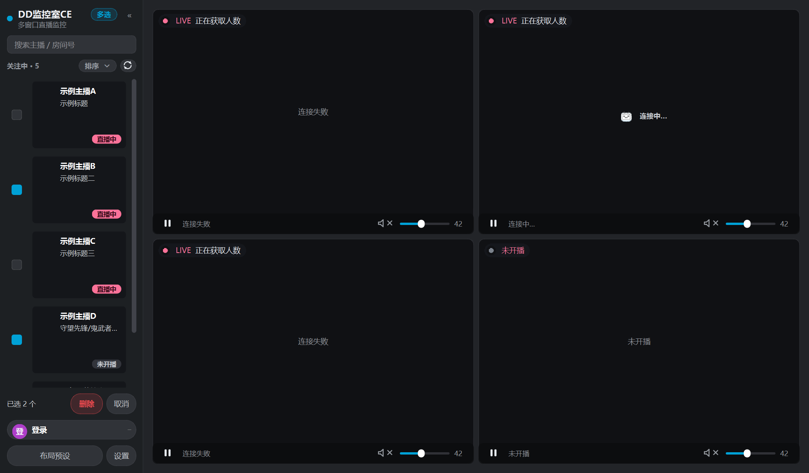
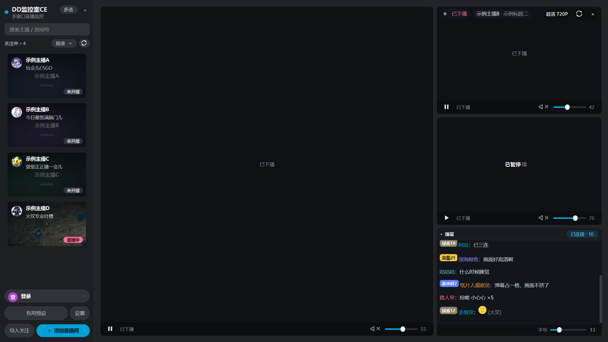
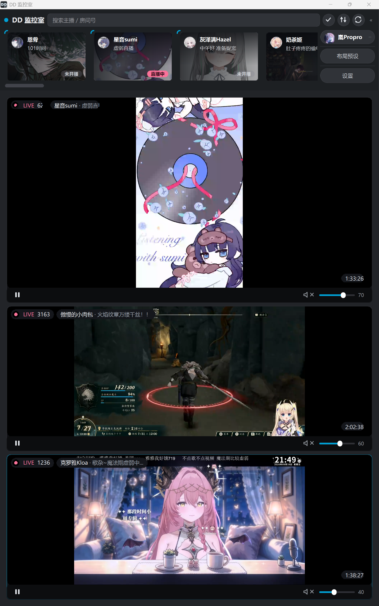

<div align="center">

# DD监控室CE

免费、开源的多窗口直播监控与观看工具，支持通过插件接入多个平台

[](#运行环境)
[](https://www.python.org/)
[](LICENSE)
[](https://github.com/Lanpropro/DD_Monitor_CE/commits/main)
[](https://github.com/Lanpropro/DD_Monitor_CE/stargazers)

[功能特性](#功能特性) · [快速开始](#快速开始) · [布局系统](#布局系统) · [开发指南](#开发指南) · [许可与来源](#许可与来源)

</div>

---

## 项目简介

DD监控室CE 是一款基于 Python、PySide6 和 VLC 的 Windows 多窗口直播监控工具，当前版本为 **0.3.1**。

它可以将多个直播间集中显示在同一个画面墙中，并提供直播状态监控、关注导入、弹幕显示、横竖屏两套布局和单路播放控制等功能。

本体支持 B 站直播；虎牙、斗鱼、抖音、Twitch 和 YouTube 由独立的平台插件接入。软件免费使用，没有付费解锁功能，官方下载与更新请认准本仓库的 [Releases](https://github.com/Lanpropro/DD_Monitor_CE/releases)。

本项目是 [DD监控室](https://gitee.com/zhimingshenjun/DD_Monitor_latest) 的二次开发版本，原作者：[执明神君](https://space.bilibili.com/637783)。在保留原项目取流与播放能力的基础上，尝试重构了界面及部分交互功能。


## 项目展示





竖屏（主画面 16:9 占满宽度、小画面填满下面）：



## 功能特性

- 📺 最多同时管理 16 路直播画面
- 🧩 横屏两套布局（平分布局 / 大带小）与弹幕布局，外加一整套竖屏预设
- 📱 竖屏模式：顶部横栏（搜索 + 图标 + 账号那一块）、主画面 16:9 占满宽度、小画面自动铺满下面
- 🔀 拖窗口换方向时，按「能放几路」自动切到最相似的另一套布局
- 🔄 自动刷新主播开播、下播及直播间状态
- 🔔 支持开播提醒
- 👀 支持关注列表悬停预览
- 📌 支持主播置顶及拖动排序
- 📁 普通文件夹支持跨平台手动分类；智能文件夹支持多选来源、开播状态与平台组合筛选，详情见 [关注列表与文件夹](#关注列表与文件夹)
- 🔐 支持 B 站扫码登录（未登录时侧栏也会露出「登录」按钮）
- 📥 支持从 B 站账号导入关注列表
- 🎚️ 每个播放格可以独立设置音量、静音、画质
- ⏺️ 每格独立录制直播流、保存最近数分钟的即时回放（便携包内置 FFmpeg）
- 🎧 每一路可以单独路由到左声道 / 右声道
- 🛠️ 支持断流重连和画面卡死检测
- 🧩 插件页支持官方插件商店和本地 ZIP 安装，插件更新保存数据并在重启后生效
- 🔄 设置 → 软件更新支持本体独立检查、下载及重启安装（EXE 版）；自动更新开关可启用启动检查和十秒悬浮提醒，流程见 [在线更新说明](docs/online-updates.md)
- 💾 自动保存布局（分横竖屏各记一套）、音量、画质和界面状态

### 录制与即时回放

录制按钮位于每块画面底栏，标着 `● 录制`；点击开始/停止。
第一次点击时需在「设置 → 录制」选择保存目录；取消设置则不会开始录制。
把「设置 → 录制 → 录制功能」的勾去掉可以整个关掉录制：各格的「● 录制」按钮收起、
右键菜单里也没有录制项、正在录的会话会正常收尾并导出（已经录到的部分不丢），
下面那些录制参数一并置灰。
右键格子可以保存最近一段（即时回放）。即时回放**跟着直播自动开**，不用手动点；
默认范围是「只跟着录制走」—— 只有正在录制的格子才开缓存。这是因为每开一格缓存
都需要额外拉取直播流并运行 FFmpeg，会增加带宽、内存和磁盘占用；
想让每格都能随时回放，可在设置里改成「所有播放中的格子」，
并用「缓存格子数上限」封顶（默认 3 格）。完全不需要这个功能的话，把「设置 → 录制 →
即时回放」的勾去掉即可：不给任何格子开缓存、右键菜单里也没有「保存最近 N 分钟」、
录制本身不受影响，照常写完整文件。
**正常关闭软件时会收尾保存录制，但不会自动导出未主动保存的即时回放。**
需要保留回放时，请在关闭软件前主动点击保存。
默认 MP4 + 原始流直存，不重编码；只有选择 H.264
重编码时，设置里的码率和帧率才生效；直接修改任一数值会自动切换到 H.264。
格式另可选 MKV、MOV、TS。默认开启「录制时锁定原画」；直播源未提供原画时不会
把较低画质当作原画录制，停止后恢复录制前的画质。可在录制设置里关闭此锁定。
文件只含这一路直播的画面和原始声音，
不含软件弹幕或控件。格子被布局隐藏、主播下播或关闭这一路时会自动停止。
保存目录空间低于警戒线时，会提示并停止该路录制；已写入分段保留在保存目录的
`.ddm-parts` 中，导出空间不足时可在清理磁盘后手动恢复。

录制和导出都跑在独立的 FFmpeg 子进程里，进程被压到 Windows 的「后台模式」
（CPU 与磁盘 IO 优先级都降到最低），并挂在主进程的 Job Object 上 —— 主进程
无论是正常退出、崩溃还是被任务管理器强杀，后台的 FFmpeg 都会一起结束，
不会留下关了软件还在偷偷录的孤儿进程。纯缓存的会话会边录边裁分段，
只保留「回放缓存时长」那么多，不会一直堆积。

## 运行环境

目前仅支持 Windows。

| 组件 | 要求 |
| --- | --- |
| 操作系统 | Windows 10/11 64 位 |
| Python | 3.10 或更高版本（**只有从源码跑才需要**；exe 便携版不用装） |
| VLC | VLC 3.x（exe 便携版已自带运行库，源码版要自己准备） |
| 图形界面 | PySide6 |
| 播放组件 | python-vlc / libVLC |
| 录制组件 | FFmpeg（exe 便携包内置，自动发现；从源码运行时可通过 `PATH` 提供） |

## 快速开始

### 方式一：下载 exe（推荐，免装 Python）

1. 到 [Releases](https://github.com/Lanpropro/DD_Monitor_CE/releases) 下载
   `DDMonitorCE-v0.3.1-exe.zip`。
2. 解压到任意目录（比如 `D:\DD监控室CE`）。
3. 双击解压出来的 **`DD监控室CE.exe`** 就能用。

这是解压即用的便携版，无需运行安装程序。首次启动会显示用户须知，确认或关闭均可正常使用，之后不再显示。

配置、缓存、日志都在解压出来的那个目录里（`utils\config.json`、`cache\`、`logs\`），
整个目录拷到别的 Windows 机器也能直接用；删掉 `utils\config.json` 等于恢复出厂设置。
`_internal\` 里是运行库（含 `libvlc.dll` 和 `plugins\`），别删。

exe 便携包内置 `ffmpeg.exe`，录制无需另行配置 FFmpeg 路径；仍需首次选择保存目录。

### 方式二：从源码运行

1. 获取项目：

```powershell
git clone https://github.com/Lanpropro/DD_Monitor_CE.git
cd DD_Monitor_CE
```

2. 创建虚拟环境：

```powershell
python -m venv .venv
```

3. 安装依赖：

```powershell
.\.venv\Scripts\python.exe -m pip install -r requirements.txt
```

4. 准备 VLC 运行库：播放功能依赖以下文件，可以从 DD监控室原项目复制到本项目根目录，
   或安装 VLC 3.x 后从 VLC 安装目录复制（`libvlc.dll`、`libvlccore.dll`、`plugins\`）。

5. 启动程序：

- 双击 `run.cmd`：普通启动，不显示控制台。
- 双击 `run-console.cmd`：显示取流、重连及弹幕日志。
- 命令行运行：

```powershell
.\.venv\Scripts\python.exe main.py
```

## 基本使用

第一次启动时，关注列表和画面墙均为空。

1. 点侧栏的「登录」按钮扫码登录 B 站账号（不登录也能加直播间，只是不能导入关注、
   部分弹幕信息会缺）。
2. 点击「+ 添加直播间」，输入直播间号、直播间链接或短链接。
3. 将主播从关注列表拖入画面墙。
4. 点击「布局预设」选择画面布局（菜单里只列当前方向能用的布局）。
5. 把窗口拖成竖的，会自动切到对应的竖屏布局；再拖回横屏同理。

登录之后还可以用「导入关注」批量导入关注的主播。可搜索主播名称，并选择放入的普通文件夹；已导入主播在左侧默认勾选，取消勾选并确认后会从本地关注栏移除，不会取消平台上的关注。明确选择目标文件夹后，已导入且勾选的主播也会移动到该文件夹；未更改文件夹选项时保留原归属。

安装平台插件后，可通过统一登录入口选择对应平台，并使用插件提供的添加和导入能力。Twitch、YouTube 登录配置可能比较繁琐，不是很建议登录；是否需要登录取决于使用的功能和插件说明。

> 登录凭证会保存在本地 `utils/config.json` 中。该文件已加入 `.gitignore`，请勿手动上传或分享。

## 布局系统

菜单里**只列当前窗口方向能用的布局**，分成三栏。

### 普通布局（横屏）

平分布局（每格一样大）：

- 单画面、上下两分、左右两分
- 四分、六分、九分、十六分（4×4）

大带小（菜单里单独一段，以小标题「大带小」开头）：

- 主画面 + 2 小、2 小 + 主画面（镜像，和前者左右相反）
- 主画面 + 3 小、主画面 + 4 小
- 上主画面 + 下 2 小
- 主画面 + 5 小环绕
- 双主画面 + 4 小

### 弹幕布局（横屏）

- 主画面 + 弹幕
- 上 1 大 + 小 + 弹幕
- 主画面 + 1/2/3 小 + 弹幕
- 弹幕在左 + 主画面 + 2 小

### 竖屏布局

竖屏不按行列等分摆，而是**主画面按 16:9 占满整宽**、小画面自动铺满下面：

- 主画面 + 2/4/6 小
- 主画面 + 2/4/6 小 + 弹幕（弹幕占最底下一整条）

### 换方向时的对映

把窗口在横竖屏之间拖动时，程序会按「能放几路」找**最相似**的那一套接上
（横屏「主画面 + 2 小」↔ 竖屏「主画面 + 2 小」，弹幕布局只对映弹幕布局），
而不是退回某个万能布局。

弹幕格会自动跟随当前主画面的直播间。布局变大时，多出来的格子保持空白，不会把
关注列表里下一个直播间自动填进来。

## 关注列表与文件夹

在关注栏空白处右键可新建普通文件夹或智能文件夹。新添加的主播默认进入「未分类」，也可在添加或导入时指定普通文件夹；所有卡片都有分类后，「未分类」自动隐藏。

- **普通文件夹**：手动存放卡片，可混放不同平台的主播。
- **智能文件夹**：按条件自动筛选。来源可选择全部关注，或多选普通文件夹及「未分类」；开播状态和平台条件同时生效。新添加的卡片在成功获取状态后参与归类。

例如创建普通文件夹「Apex」，再创建智能文件夹「Apex 正在直播」，来源选「Apex」、状态选「开播」。可选择「匹配时移入显示，不匹配时回到原处」，或「保留原处，同时在智能文件夹显示」。两种方式都保留原始归属；多条移入规则匹配同一主播时，优先显示在最靠前的智能文件夹。

文件夹标题支持拖动排序；拖动时临时收起文件夹，完成或取消后恢复原来的展开状态。右键文件夹可修改规则和排序。关注栏的排序按钮分别设置各文件夹内的卡片顺序，分组和顺序会在重启后保留。

| 排序方式 | 说明 |
| --- | --- |
| 自定义顺序 | 通过拖动调整顺序，并自动保存 |
| 开播优先 | 正在直播的主播自动排在前面 |
| 未开播优先 | 未开播的主播自动排在前面 |
| 导入顺序 | 按主播加入关注列表的先后排列 |
| 主播名称 | 按主播名称排列 |

置顶的直播间优先显示。手动拖动卡片后，对应文件夹切换为自定义排序；卡片可在文件夹之间移动。

## 弹幕功能

弹幕面板目前支持：

- 粉丝牌和 B 站表情显示
- 字体与字号调整
- 屏蔽词过滤

未登录时，部分弹幕用户名可能会被 B 站隐藏，建议登录后使用。

每个画面底栏的「弹幕」按钮可独立启用滚动画面弹幕（窄格显示「弹」），多格子与全屏均可使用，重启后保留开关。
在每格右下角的弹幕设置中调整画面弹幕大小、速度、不透明度、顶部显示区域，以及是否随画面大小缩放。
画面弹幕与弹幕格共用字体和屏蔽词，同一直播间共用接收连接；暂停时不积压弹幕，密集弹幕自动避让，满轨道时丢弃新消息。
当前画面弹幕显示普通文字与原弹幕颜色，二路插件的画面弹幕后续接入。

切换格子全屏时保留正在显示的弹幕。全屏会把手动画质提升至最高可用档位；使用自动画质时继续沿用自动选择逻辑。

## 软件更新

在「设置 → 软件更新」检查版本、查看更新说明和下载本体更新。没有新版时展示当前版本说明。EXE 版下载完成后可点击「重启并更新」，程序会保存设置、收尾录制，再安装并启动新版，保留关注、文件夹、账号和用户插件数据。

「自动更新」是启动检查与提醒开关，默认关闭。开启并保存后，下次启动若检测到新版，会显示可点击跳转更新页的悬浮提示；十秒未点击自动消失，不会自行安装。源码版可检查新版和打开发布页，更新代码需手动操作；旧 0.2 版首次升级到 0.3 也需要手动下载。

本体与插件分开更新，插件更新入口在插件商店。发布和校验流程见 [在线更新说明](docs/online-updates.md)。

检测到新版时，设置入口和对应更新导航的右侧显示红点。启动时也会检查已安装插件，复用商店缓存；有更新则在上方居中提示，点击进入相应更新页，十秒后自动消失。查看对应更新页后，即使暂不安装也会清除该版本的红点；以后发现更高版本时重新提醒。下载后等待重启的插件也不再标红。

## 快捷键

| 默认按键 | 功能 |
| --- | --- |
| `F` | 全屏查看鼠标所在的格子 |
| `Esc` | 退出全屏 |
| `M` | 静音 / 取消静音鼠标所在的那一路 |
| `E` | 声音轮询按键：鼠标所在格子依次切换静音 → 双声道 → 左声道 → 右声道 → 静音 |
| `Alt` + `M` | 只保留鼠标所在画面的声音（鼠标不在画面上＝全部静音） |

快捷键可以在程序设置中修改。

## 配置、日志与缓存

| 内容 | 路径 |
| --- | --- |
| 用户配置 | `utils/config.json` |
| 配置备份 | `utils/config.json.bak` |
| 运行日志 | `logs/ddm-YYYY-MM-DD.log` |
| 主播头像 | `cache/avatars/` |
| 直播封面 | `cache/covers/` |
| 弹幕表情 | `cache/emoticons/` |

## 开发指南

安装依赖后，可以通过以下入口逐个运行 `dev/selfcheck_*.py` 自检：

```powershell
dev\run-checks.cmd
```

其中部分脚本需要网络、真实直播流或 Windows 原生窗口环境。也可按改动范围运行对应脚本；请检查各脚本结果，批量入口显示「全部跑完」不代表所有检查通过。

要打发布包（exe 便携版 + 源码包 + 两个 zip，输出到 `results\`）：

```powershell
powershell -File dev\build_release.ps1
```

> 冻结 exe 用的是单独的 PySide6 6.9 依赖目录 `work\deps`（主开发环境是 6.11，
> 6.11 冻出来的 exe 起不来）；脚本缺了会提示怎么装。

### 仓库文件导航

| 位置 | 内容 |
| --- | --- |
| `main.py`、`ddm/` | 程序入口与应用代码；`app.py` 管状态和流程，`widgets.py` 管主要控件，`layouts.py` 管布局，`player.py` 管播放 |
| `blivedm/`、`plugins_user/` | 弹幕协议代码与用户插件 |
| `dev/`、`docs/` | 开发自检、预览脚本与使用说明、截图 |
| `utils/config.json`、`cache/`、`logs/`、`recordings/` | 运行时配置与数据，不提交到 Git；发布文件生成在 `results/` |

**修改软件「设置」窗口中的文字：**打开 `ddm/dialogs.py`。`GeneralSettingsPage` 是「常规」，
`DanmakuSettingsPage` 是「弹幕」，`RecordingSettingsPage` 是「录制」，
`ShortcutSettingsPage` 是「快捷键」；导航名称和「保存／取消」等按钮文字在 `SettingsDialog`。
设置入口按钮的文字在 `ddm/widgets.py`，窗口外观在 `ddm/theme.py`。
如果要改默认值而不是显示文字，修改 `ddm/config.py` 的 `DEFAULT_SETTINGS`；
个人已保存的设置在 `utils/config.json`。

## 已知限制

- 目前仅在 Windows 上使用和测试。
- 依赖 B 站非公开接口，接口调整可能导致部分功能失效。
- 源码方式运行需要自己准备 VLC 运行库（exe 便携版已自带）。
- 接别的直播平台仍走插件接口；录制与即时回放已经内置。

## 插件

在「设置 → 插件」的「插件商店」选择官方插件即可下载并安装；「已安装」页可查看版本、启用或删除插件。安装、更新和启用更改保存并重启后生效，插件版本独立于本体。

商店使用本地缓存，不会每次打开都重新下载目录；停留时定期检查变化，也可使用页签右侧的「刷新插件商店」立即检查。只展示官方仓库发布的安装包，未发布插件无法在线安装。

| 插件 | 平台与用途 |
| --- | --- |
| 国内直播平台（`domestic_live`） | 虎牙、斗鱼、抖音的直播接入 |
| 海外直播平台（`global_live`） | Twitch、YouTube 的直播接入 |
| 比赛二路同步（`match_sync`） | 多路比赛画面对齐、声音与弹幕合并；是否可安装以商店发布状态为准 |

平台能力取决于插件版本，本体发布包不内置上述扩展。插件源码与下载见 [DD_Monitor_Plugins](https://github.com/Lanpropro/DD_Monitor_Plugins)。也可点击「装载插件…」或拖入符合格式的本地 ZIP 包。开发自己的插件时需包含 `plugin.json` 和 `plugin.py`，接口说明见 [`docs/plugins.md`](docs/plugins.md)。

- 接别的平台的骨架：`plugins_user/_template_platform/plugin.py`

插件是受信任代码，和本体同进程运行 —— 只装自己看过源码的插件。
还没做、打算怎么做的，记在本地 `idea.txt`（不随仓库提交）。

## 贡献

欢迎提交 Issue 或 Pull Request。提交问题时，建议附上 Windows、Python 和 VLC 版本、问题复现步骤、对应日志及必要的界面截图。
你也可以尝试直接私信[b站账号](https://space.bilibili.com/193559518)
请在分享日志前检查并移除账号凭证等敏感信息。

## 致谢

- [DD监控室](https://gitee.com/zhimingshenjun/DD_Monitor_latest)：原始项目及主要播放、取流实现参考。
- [blivedm](https://github.com/xfgryujk/blivedm)：B 站直播弹幕协议实现。
- [BewlyCat](https://github.com/keleus/BewlyCat)：界面配色和部分视觉设计参考。

详细来源说明请参阅 [`NOTICE.md`](NOTICE.md)。

## 许可与来源

本项目基于 **GNU Lesser General Public License v2.1** 发布。

使用、修改或分发本项目之前，请阅读：

- [`LICENSE`](LICENSE)
- [`NOTICE.md`](NOTICE.md)

## 免责声明

本项目是个人维护的第三方工具，与哔哩哔哩官方无关。

本项目的使用、修改与分发权利以 [`LICENSE`](LICENSE) 为准。使用者应自行遵守哔哩哔哩用户协议以及所在地适用的法律法规，并自行承担使用本项目可能产生的风险。
